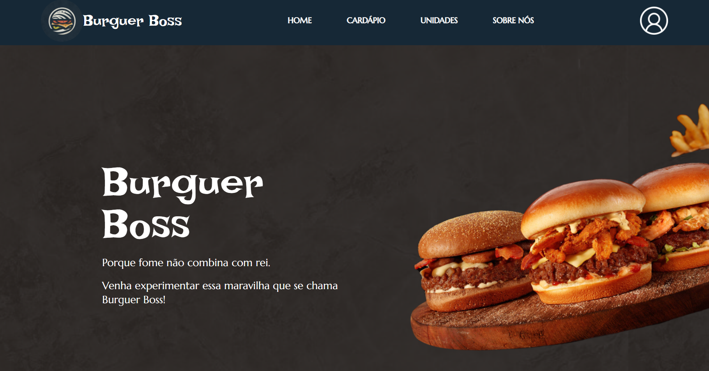

# React + TypeScript + Vite

# Burguer Boss

<h2>Descrição do Projeto</h2>
Projeto universitário para gestão de uma hamburgueria. Nesse web site é possível fazer toda a gestão de ocupação de mesas, controle de cardápio, pedidos e usuários, acompanhamento de pedidos e emissão de relatórios.

# :hammer: Funcionalidades do projeto
- `Funcionalidade 1`: Efetuar login
- `Funcionalidade 2`: Gerenciar mesas (Adicionar e retirar mesas, verificar ocupação)
- `Funcionalidade 3`: Manter cardápio (Adicionar itens ao cardápio, atualizar, excluir)
- `Funcionalidade 4`: Manter pedidos (Criar pedidos, atualizar, excluir)
- `Funcionalidade 5`: Acompanhar pedidos (Verificar e atualizar status do pedido)
- `Funcionalidade 6`: Manter usuários (Criar, atualizar e excluir usuários do sistema)
- `Funcionalidade 7`: Emitir relatórios

# 🚀 React + TypeScript + Vite

Este projeto foi criado com Vite, React e TypeScript para um desenvolvimento rápido e eficiente.

## 📋 Pré-requisitos

- Node.js 18+
- npm ou yarn

## 🛠️ Como executar

**Clone o repositório**

- git clone https://github.com/PedroMarineli/bb_front-end.git

## 📦 Comandos disponíveis

- npm run dev	- Inicia servidor de desenvolvimento
- npm run build	- Cria build para produção
- npm run preview	- Pré-visualiza a build de produção

# Autores
| [ Fabio Andrade](https://github.com/FabioBarAnd) |  [ Matheus Rebello](https://github.com/msrebello) |  [ Pedro Marineli](https://github.com/PedroMarineli) |
| :---: | :---: | :---: |